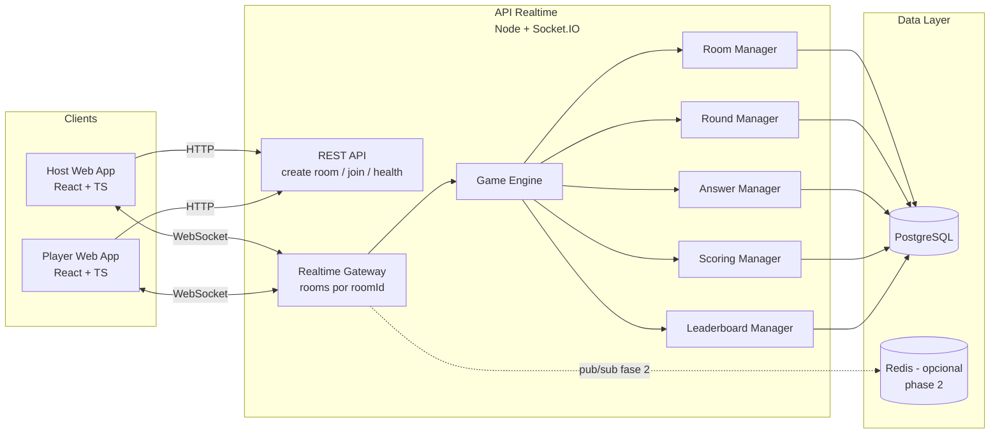
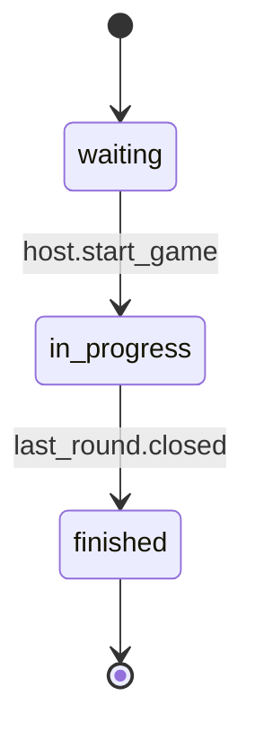
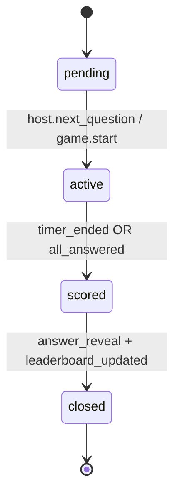
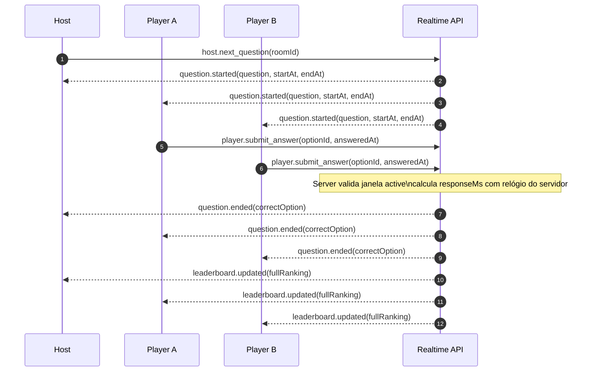

# Architecture

Este documento consolida a arquitetura MVP do Kahoot-BT com foco em simplicidade, modularidade e tempo real.

## 1) Arquitetura de Componentes



## 2) Room State Machine



Regras:

- Apenas salas `in_progress` aceitam eventos de resposta.
- Uma sala tem no máximo 1 rodada `active` por vez.

## 3) Round State Machine



Regras:

- Resposta é aceita apenas em `active`.
- Cada jogador responde no máximo 1 vez por rodada.
- Pontuação é aplicada somente na transição `active -> scored`.

## 4) Fluxo Realtime (Pergunta)



## 5) Contrato de Eventos (MVP)

### Client -> Server

- `room.join` `{ roomId, username }`
- `host.start_game` `{ roomId }`
- `host.next_question` `{ roomId }`
- `player.submit_answer` `{ roomId, roundId, optionId }`

### Server -> Client

- `room.state_updated` `{ roomId, status, players }`
- `question.started` `{ roomId, roundId, question, startedAt, endsAt }`
- `question.ended` `{ roomId, roundId, correctOptionId }`
- `leaderboard.updated` `{ roomId, ranking[] }`
- `game.ended` `{ roomId, ranking[] }`

## 6) Regras de Scoring (Determinístico)

```text
timeLimitMs = 120000
maxPoints = 120

if incorrect => 0
if correct:
  remainingMs = max(0, endsAtServer - answerReceivedAtServer)
  score = round(maxPoints * (remainingMs / timeLimitMs))
  score = max(1, score)
```

Desempate do ranking:

1. Maior `totalScore`
2. Menor `totalResponseMs` (somatório das respostas corretas)
3. Menor `firstCorrectAt` (quem acertou antes no tempo global da partida)
4. `username` (ordem alfabética) como desempate final estável

## 7) Escalonamento em Fases

1. Fase 1: 1 instância API + Postgres.
2. Fase 2: adicionar Redis adapter para Socket.IO (N instâncias).
3. Fase 3: métricas por sala (`latency`, `activeSockets`, `answers/sec`) e autoscaling.
